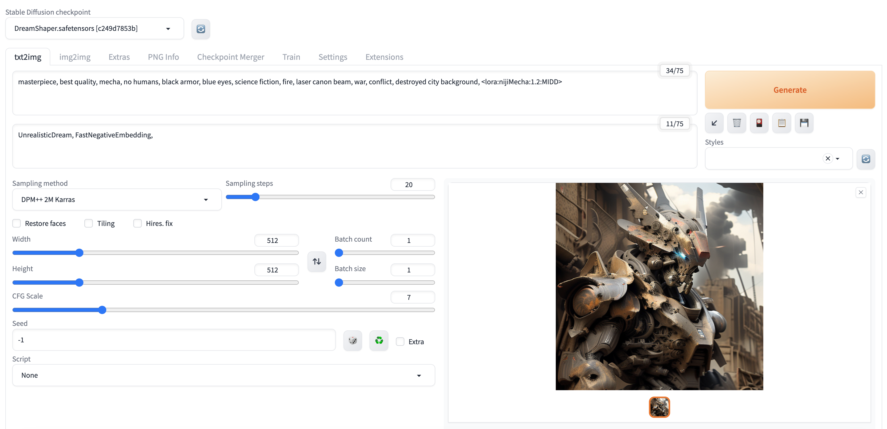

**这里提供了在Google Colab或者kaggle的GPU算力上免费搭建stable-diffusion-webui，进行AI绘画的notebook**

stable diffusion有一个很大的优势就是基于各式各样的模型，我们可以进行不同风格的AI绘画。

- stable diffusion的基础模型可以在[hugging face](https://huggingface.co/stabilityai)下载

- [C站](https://civitai.com/)可以下载各种风格的模型
- stable diffusion：[Git](https://github.com/CompVis/latent-diffusion)｜[论文](https://arxiv.org/abs/2112.10752)
- stable-diffusion-webui：[Git](https://github.com/AUTOMATIC1111/stable-diffusion-webui)

